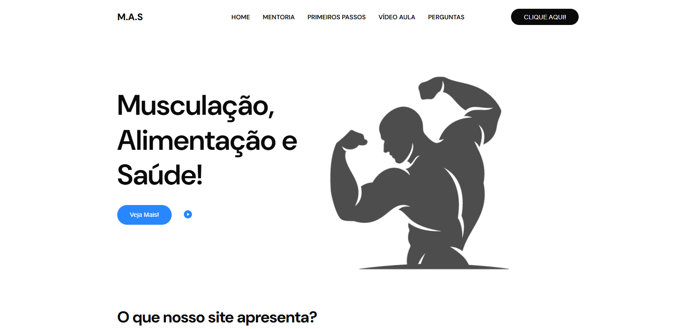

# 🏋️‍♂️ M.A.S – Musculação, Alimentação e Saúde

**M.A.S (Musculação, Alimentação e Saúde)** é um site informativo desenvolvido como **projeto acadêmico (escolar)**, com o objetivo de incentivar hábitos saudáveis por meio da prática de exercícios físicos e de uma alimentação equilibrada.

O projeto foi criado para ajudar usuários a planejarem sua rotina de treinos e dieta, promovendo mais qualidade de vida e bem-estar, além de aplicar na prática os conhecimentos adquiridos durante o curso.

---

## 📌 Sobre o Projeto

O site surgiu da ideia de unir **informação, orientação profissional e organização pessoal**, facilitando o acesso dos usuários a conteúdos relacionados à saúde física.

Como parte do projeto acadêmico, foi simulada a parceria com um **personal trainer**, responsável por auxiliar na criação dos conteúdos e orientar práticas de treino de forma segura e eficiente.

---

## 🎯 Objetivo Principal

Ajudar os usuários a:

- Planejar uma **rotina de treinos**
- Organizar uma **dieta equilibrada**
- Compreender os **benefícios da prática de exercícios físicos**
- Adotar um **estilo de vida mais saudável**

---

## 💡 Funcionalidades do Site

- 📚 Conteúdo informativo sobre musculação, alimentação e saúde  
- 💪 Explicação dos benefícios da atividade física regular  
- 📋 Planejamento de dieta e rotina de treinos  
- 🎥 Área de vídeo-aulas disponibilizadas por um coach parceiro  

> ⚠️ **Observaçã:**  
> A área de vídeo-aulas encontra-se atualmente **fora do ar**, pois os vídeos foram arquivados pelo coach. A funcionalidade permanece no site apenas para fins demonstrativos do projeto acadêmico.

---
## 🛠️ Tecnologias Utilizadas
- HTML5 — Estrutura da aplicação
- CSS3 — Estilização responsiva
- JavaScript — Efeitos Visuais

---

## 🤝 Parceria Profissional

O projeto apresenta a simulação de uma parceria com um **personal trainer**, responsável por:

- Auxiliar na elaboração dos conteúdos
- Garantir maior credibilidade às informações
- Contribuir com vídeos educativos e orientações práticas

---

## 🧠 Público-Alvo

- Pessoas que desejam iniciar uma rotina de exercícios  
- Usuários que buscam melhorar a alimentação  
- Interessados em saúde, bem-estar e qualidade de vida  

---

## 🎓 Contexto Acadêmico

Este projeto foi desenvolvido com fins **educacionais**, como parte de um **trabalho escolar**, tendo como objetivo aplicar conceitos de desenvolvimento web, organização de conteúdo e experiência do usuário.

---

## ❤️ Considerações Finais

O **M.A.S – Musculação, Alimentação e Saúde** demonstra como a tecnologia pode ser utilizada como ferramenta educacional na promoção da saúde, unindo informação, planejamento e orientação profissional em um único ambiente digital.
